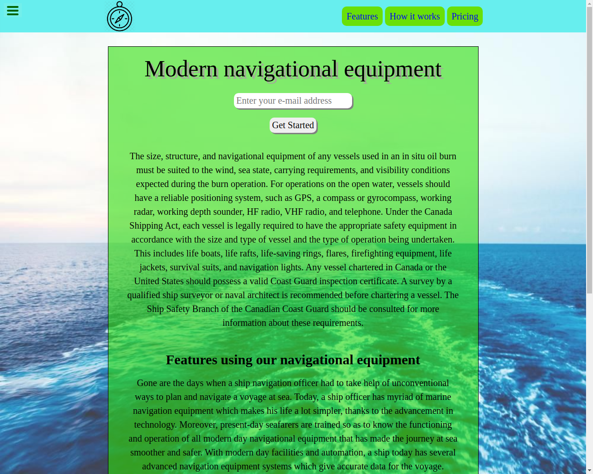

# Product landing page

> This project is made as part of FreeCodeCamp responsive web design certification course

Sample of static responsive web page 

## Built With

- HTML
- CSS/SCSS
- JavaScript

## Live Demo

[Live Demo Link](https://igors78.github.io/product-landing-page/)

## Getting Started

**See the page via the link above**

## Authors

👤 **Author**

- GitHub: [@github](https://github.com/Igors78)
- Twitter: [@twitter](https://twitter.com/oleinikovs)
- LinkedIn: [LinkedIn](https://www.linkedin.com/in/igors-oleinikovs-17a10958/)

## Show your support

Give a ⭐️ if you like this project!

## 📝 License

This project is [MIT](./license.txt) licensed.
